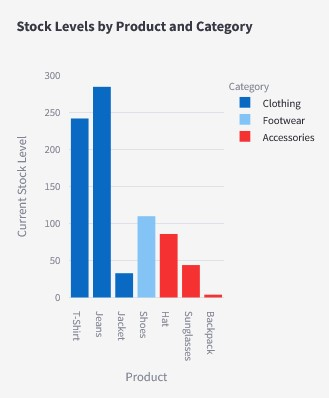
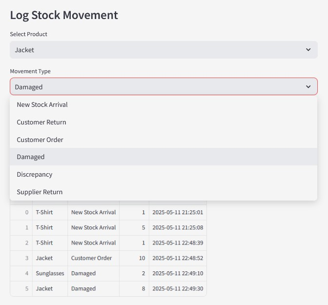
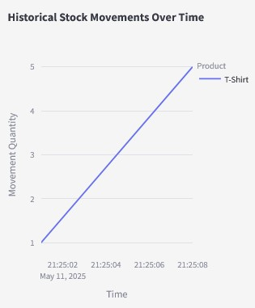

## StockFlow - Small Retailers
A lightweight inventory management app for small businesses.  

## 🔍 What It Does
StockFlow helps small retailers track inventory levels, log stock movements (sales, restocks, returns), and visualize trends—all in real-time.  

## 🚀 Try It Live
🔗 [Live Demo on Streamlit Cloud](https://stockflow-app.streamlit.app)

Interact with the app directly in your browser—no installation required.   

## 🧾 Key Features
Track Stock Levels : View current inventory by product and category.

Log Movements : Record sales, restocks, returns, and discrepancies.

Visualize Trends : Side-by-side charts show stock levels and historical movement trends.

CSV Import/Export : Easily back up or update data via CSV files.

Low Stock Alerts : Get warnings when inventory falls below thresholds.

## 📸 Screenshots  
  
*Current stock levels by product and category.*

  
*Log Stock Movements.*

  
*Historical stock movements with hover tooltips.*

## 📊 Sample Data Included
This app includes fake/sample data for demonstration purposes only.

stock_data.csv: Sample stock levels.
movement_log.csv: Example stock movement logs.
⚠️ These files are for showcasing the app’s UI. Replace them with your own data for real-world use.   

## 📄 License
StockFlow - Small Retailers is protected under the following license:

Copyright (c) 2025 Sorina Oanta

This software is provided for demonstration and non-commercial use only.
For commercial use or redistribution, contact oantas@yahoo.com  

## 📌 Notes for Users
This app is designed for small retailers to manage inventory efficiently. If you'd like to:

Request custom features (e.g., database integration, multi-user access).
Integrate with your existing systems,
📧 Contact us at oantas@yahoo.com for licensing or customization.  

## 🧰 Tech Stack  
- **Frontend**: [Streamlit](https://streamlit.io/ )  
- **Data Visualization**: [Plotly Express](https://plotly.com/python/ )  
- **Data Handling**: [Pandas](https://pandas.pydata.org/ )   

